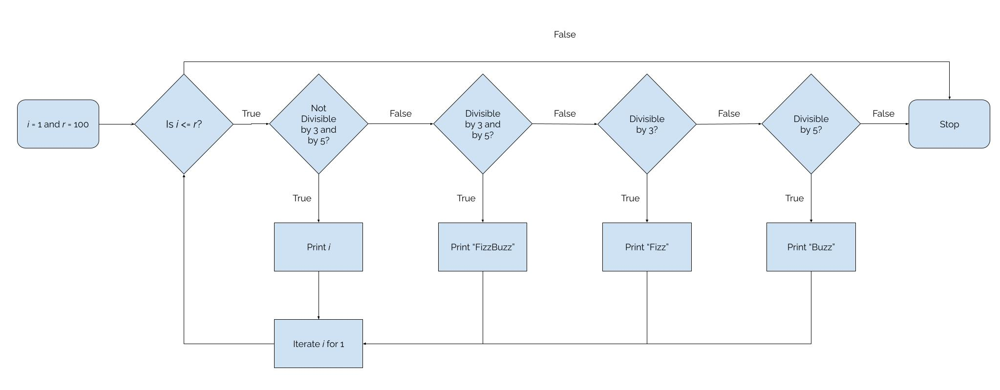

# FizzBuzz

Since taking my current role a few years ago I've had to work on more an more scripts and code that has been developed using the product I support. I'll start off by saying I'm not a developer. I use scripts and some light coding to accomplish what I need to, but my experience is more on the infrastructure side fo things.

However, many of the concepts of coding I use in my day to day for various tools. Such as booleans, if else workflows, etc. So I decided to try my hand at FizzBuzz, which is a common coding scenario many people interviewing for development positions tend to take.

## FizzBuzz Parameters

The common concept of FizzBuzz is you have a range of numbers. With this range of numbers you will print them out line by line. If a number is divisible by three, then print `Fizz`. If a number is divisble by five, then print `Buzz`. Finally, if it is divisble by both print `FizzBuzz`. These are the basics of the scenario. Below I'm going to document some assumptions, because with any given solution there could be many factors involved so I'm going to make assumptions about a few.

### Assumptions

1. Compute power isn't an issue. Since, most of the time no one specifies it's running on a machine with these given specs. I'll assume I have unlimited compute power.

2. There are no other dependiences outside of this code I need to worry about. If there are other pieces of code I have to worry about or factor in for the future, then the presented code would look different. I'd take those design decisions in to consideration now. So we'll treat this as the specific thing I'm solving and no other future state.

3. This is my perspective as is with current experience. Given my current state I may reevaluate based on experience, but this specific solution is, as is, now as a relative novice with few specifics to pull from for that experience.

## My solution, but more about my reasoning

I wanted to start by taking a look at the entire problem before diving into a solution. I'll say _i_ is 1, which is the starting integer and _r_ is 100 and end of the range we'll run through. In order to evaluate every step, we'll need to check is _i_ less than or equal to _r_. If yes or true, then we'll move to the next and if no we'll stop.

The next step I want to be able to tell if a number is divisible by three or five. I chose this specific to start is rather than say 15, which might not always be the case. If I wanted to change the parameters later I could refactor to make the divisors changable as either inputs or variables. I chose the not, because I'd rather evaluate if you can't divide first than just throw it to print value as an else. I've just run into this with certain tools that excluding first makes it easier to iterate. We print a value if you can't divide by both and add one to the iterator and start back at step two. If not we move to the next step.

Here we check first if both three and five van divide the current value. If so then we'll write `FizzBuzz` and iterate by one. If not we'll move to the next step. Again reasoing around not using 15 is would be easier to refactor if not the case in the future.

During this step we check is it divisible by three, then we print `Fizz` and iterate by one and start back at step two. I could add and not divisble by five and did in my initial testing, but found since I've already filtered out not necessary, but could be a nice check to revalidate. We move to the next step.

This step is similar to the last, but we check if divisible by five and print `Buzz` and iterate by one and start back at step two. Same applies to the previous step in adding a second check for and not divisible by three, but not neccesary.

Finally, if none of the previous steps match we want to stop. I acheive this by running a break in many cases. The reason I did this is that rather than have a default behavior of printing the value in many cases I would need some sort of stop gap so it doesn't run infinitum. I've had situations with other software or scenarios that for whatever reason something unexpected could be passed through and we'd rather fail than just continuoulsy run.

This covers all of my reasoning, assumptions, and work. You can see in the attached folders my samples. Thanks for taking the time to read through my solution.

## Code Samples

1. [Golang](code_samples/go/main.go)

2. [Python](code_samples/python/fizzbuzz.py)

3. [JS/Node.js](code_samples/nodejs/fizzbuzz.js)
